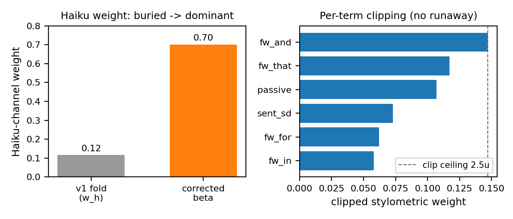

# Author-voice calibration in SWS: method, validation, and correction

## Abstract

SWS voice calibration learns a reusable profile from an author's own papers so the drafter and reviser write in that author's register. Knowing when the voice is good enough is the hard part, since no author writes identically across papers. The method holds out a recent paper, regenerates one section on its real content, and stops when the generated prose sits as close to the original as the author's papers sit to each other — a self-similarity band. The v1 design scored this with one weighted squared distance that folded a model voice judgment into a stylometric term. Dogfooding exposed an anti-correlation: against a real Haiku judge, an off-voice draft passed the band while a better-voiced one failed it. The corrected method combines two channels at the similarity level, S = α·k_stylo + β·h, with weights fit from same-versus-different-author separation (β ≈ 0.70). Five regenerations gave S = 0.587 ± 0.072; this is a heuristic observation over n=5 generations on one prompt, not a significance claim. Validation covered the Introduction section only, on one author's corpus (n=5 generations).

## Background and motivation

SWS drafts and revises scientific manuscripts in a docx-first workflow, where the generated prose has to sit beside an author's own writing without reading as foreign. A generic competent register is not enough. Reviewers, co-authors, and the author all carry an implicit model of how a given lab writes, and a draft that misses that register costs revision time even when its content is sound. Voice calibration exists to close that gap: it learns a reusable voice profile from an author's own papers so the drafter and reviser produce text in the author's register rather than a house default.

The hard question is how to know when the learned voice is good enough. An absolute target is the wrong yardstick, because no author writes identically from one paper to the next. The method instead uses a held-out test with a self-similarity band as the ceiling. One of the author's recent papers is hidden, one of its sections is regenerated in the candidate voice on that paper's real content, and the generated text is scored against the real text. Holding content fixed makes voice the only free variable. The stopping rule follows from a simple observation: a model cannot imitate an author more closely than the author imitates themselves across their own papers. The spread of similarity among an author's own papers defines the band, and a candidate draft that lands inside it has matched the voice as well as the author does.

## The v1 method

The first design scored a candidate against a reference with one weighted squared distance:

`D = Σ_i w_i (z_i(x) − z_i(y))² + w_h (1 − haiku_sim)`

Here `z` is a standardized 17-feature stylometric vector covering sentence-length mean and standard deviation, hedge density, connective density, passive ratio, lexical diversity, first-person-plural rate, and ten function-word frequencies: fw_the, fw_of, fw_and, fw_to, fw_in, fw_that, fw_we, fw_is, fw_for, fw_as. Each feature was standardized so that the squared differences entered on a common scale.

The per-feature weights `w_i` came from a diagonal Fisher ratio [1], the between-class over within-class variance estimated from boundary conditions, so that features separating one voice from another counted for more than features that varied freely within a single voice. The distance was then mapped to a similarity through an RBF kernel [5], `S = exp(−γD)`, with `γ` set from the median of intra-author distances so the kernel's scale tracked the corpus.

A model voice-similarity judgment was folded into the same distance as the `w_h (1 − haiku_sim)` term, the intent being a single number that combined measurable stylometry with a holistic read of voice. One distance, one similarity, one band to compare against.

## Validation by dogfooding

We validated the calibration method on a real corpus of roughly fourteen papers from a single author working in chemistry (de novo metalloproteins), spanning first-, last-, second-, and middle-author roles. One recent first-author paper was withheld as the hidden target, and one of its sections was regenerated on the paper's own real claims so that register stayed the only free variable, then scored against the held-out original.

The first attempt taught the most important lesson, and it concerned the baseline. We placed a close co-author in the negative ("not-this-author") class. Because that co-author writes a near-twin style, the metric read shared craft as evidence of a different author, and the top discriminators collapsed into bulk function-word frequencies (fw_and near 0.19, fw_of near 0.14) — an artifact rather than a fingerprint. Replacing that class with four external groups from the same subfield moved the discriminative signal to clause architecture: subordinate "that"-clauses (fw_that), purpose-framed "for" (fw_for), and sentence-length variance. The general rule follows directly. The negative class defines what "your voice" means, so it must be drawn from genuine outsiders. Collaborators, aspirational co-authors, and one's own lab all leak the very style the profile is meant to capture, and they should never populate the baseline.

A fairness check followed, scored by a real Haiku judge on a 0-to-1 voice-similarity scale. The author's self-similarity averaged 0.667; the peers' self-similarity averaged 0.73. Cross pairs were lower: author-versus-peer 0.330 and peer-versus-peer 0.450. The author was therefore no more recognizable than the peers were to each other, and if anything slightly less. This ruled out a confound in which the method merely keyed on an unusually distinctive author. It also pointed to a stronger design: rather than treat the author as a single positive class against an outsider negative, we enriched the baseline into a same-author-versus-different-author metric [2, 3]. The positive set became same-author pairs, including each peer matched against themselves; the negative set became different-author pairs, including peer-versus-peer. The result is a metric grounded in the general distinction between authors, not in one author's idiosyncrasy.

## Pitfalls uncovered

Dogfooding the v1 metric on the held-out paper exposed five failures. Each one, on its own, is enough to invalidate a voice score; together they explain why the original design could pass off-voice text and reject on-voice text.

The first pitfall was the self-judge. When an Opus model graded its own generated section, it rated that output 0.8 or higher and reported convergence. A strict, real Haiku judge scored the first attempt from the real drafter at only 0.42, which it labeled a clearly different voice. The early optimism was an artifact of a model grading itself. Any voice score that depends on the generating model also acting as referee inherits that bias, so the judge must be an independent model.

The second pitfall is the most damaging, because the metric did not merely add noise; it inverted the quantity it was supposed to track. Under v1, an off-voice draft (real-Haiku voice 0.42) passed the self-similarity band at a blended score of 0.529, while a better-voiced draft (voice 0.68) failed at a blended score of 0.245. The blended distance ran opposite to voice. Optimizing against it would have driven the drafter away from the author's register, not toward it. Figure 1 shows the reversal directly.

*Figure 1. v1 versus corrected metric on two drafts of the same held-out section.*

Three structural faults sat underneath the inversion. First, a single function word dominated: `fw_and` alone contributed about 1.0 of a total distance near 0.96, so the metric was effectively one feature wide and brittle to any shift in that feature. Second, the Haiku term was inconsistent with its own fit. It was fitted as a squared quantity, (1 − sim)², but applied linearly as (1 − sim), and it was never standardized the way the 17 stylometric features were. The squared-versus-linear mismatch, compounded by the unit mismatch, made the term incommensurable with the rest of the distance. Third, even after fitting against a real judge, the Haiku weight came out at roughly w_h = 0.116. A weight that small cannot gate a distance dominated by stylometry, so the channel that actually distinguished the author from external groups carried almost no influence on the verdict.

Read in sequence, the five pitfalls point to one diagnosis: combining a stylometric distance and a model-judged similarity inside a single weighted distance buries the discriminating channel and risks sign inversion. The correction in the next section addresses each fault at its source.

## The corrected two-channel method

The v1 failures share one root cause: the metric mixed quantities that do not belong on the same axis. The stylometric distance entered as a sum of squared standardized differences, while the Haiku voice term was fit as a square but applied as a raw linear gap and never standardized against the stylometric features. The fix is to stop combining at the distance level and combine at the similarity level instead.

Both channels are first mapped into [0,1]. The stylometric channel becomes a kernel similarity, k_stylo = exp(−γ·Σ w_i (Δz)²), and the Haiku channel h is the real judge's voice score, already on a 0–1 scale. The combined score is then a simple convex blend:

    S = α·k_stylo + β·h.

Because both terms are similarities in the same range, the squared-versus-linear inconsistency and the unit mismatch — the "dimensional burden" of the v1 distance — disappear. There is nothing left to standardize across incompatible scales.

The mixing coefficients α and β are not hand-set. Each is fit from how well its own channel separates same-author from different-author pairs in the baseline, so the channel that discriminates better earns more weight. Fit this way, the Haiku channel carries roughly β ≈ 0.70 against α ≈ 0.30 for stylometry — the reverse of the v1 fold, which had buried the judge at a weight near 0.12.

Within the stylometric channel, each per-term weight is clipped to [0.4u, 2.5u], where u = 1/n_features is the uniform weight, then renormalized iteratively. Clipping stops any single feature from dominating: the worst offender, the function word "and", drops from a weight near 0.20 to a capped 0.147.

The baseline itself is enriched. Positives are same-author pairs (the author's papers plus peer-self pairs); negatives are different-author pairs (author×peer plus peer×peer). This makes the metric a proper same-versus-different-author classifier [4] rather than a one-author-against-the-world judgment.

The self-similarity band is recomputed with the combined score, Haiku included, so the band ceiling and any candidate draft live on one shared axis; note that the band is recomputed on the new combined-score axis, so the v1 and v2 bands are not directly comparable. That alignment is what removes the v1 anti-correlation, where an off-voice draft could clear the band and a better-voiced draft could fail it. With an honest fit, a single combined gate (S inside the band) suffices; a dual gate was considered and proved unnecessary.

One operational constraint remains. The Haiku channel only works with a real judge. Fed a constant, h adds no separation, the fit drives β toward zero, and the channel collapses. Production therefore sets β = 0 and runs stylometric-only explicitly rather than passing a constant through a channel that can no longer discriminate.

*Figure 2. Haiku channel weight in the v1 fold versus the corrected fit, with clipped per-feature stylometric weights.*

## Results

A real Haiku judge separated authorship at both levels of the enriched baseline. Sections written by the held-out author scored a self-similarity mean of 0.667, against 0.330 when the same author's text was paired with the four external groups. The separation held for the peers as well: peer self-similarity averaged 0.73, while peer-against-peer pairs scored 0.450. The judge therefore distinguished same-author from different-author prose in both directions, which is the property the metric needs in order to learn a voice rather than a single writer's idiosyncrasy.

Fitting the channel mix to that same-versus-different separation gave α (stylometric) ≈ 0.30 and β (Haiku) ≈ 0.70. The Haiku channel was the stronger discriminator by more than a factor of two. The v1 design had folded this signal into the distance as the single w_h term and fit it to ≈ 0.12, so the channel that carried most of the discriminative power was the channel the earlier method had suppressed. Recombining at the similarity level and fitting each channel from its own class separation recovered the weight the signal deserved.

The corrected metric also re-ordered the two trial drafts correctly. The round-1 draft, judged at voice 0.42, gave a combined S of 0.444, below the self-band. The round-2 draft, judged at voice 0.68, gave S = 0.559, inside the band. Under v1 these two had inverted, with the off-voice draft passing and the better-voiced draft failing; the two-channel score now tracks the judge instead of fighting it.

To test repeatability we ran n=5 independent drafter-flagship generations from one reserved-register prompt, each scored with the corrected metric. The combined score was S = 0.587 ± 0.072, against a band mean of 0.578 and a band of [0.507, 0.650]. The Haiku voice channel was 0.714 ± 0.088, and 4 of the 5 samples landed in or above the band. This is a heuristic observation over n=5 generations with a single prompt, not a claim of statistical significance: the SD of ±0.072 is comparable to the band width of ~0.14, and 1 of 5 samples fell outside the band. With that caveat, the stylometric channel was noisy across the run (k_stylo spanning 0.23–0.36), but the stable Haiku channel carried the combined score into the band sample after sample. That division of labor is the point of the correction. A single stylometric distance would have inherited the full spread; pairing it with the steadier judge channel keeps the gate usable on a corpus this small.

![Five independent drafter-flagship generations scored with the corrected two-channel metric. Combined S (0.587 ± 0.072) and the Haiku voice channel (0.714 ± 0.088) are plotted against the author self-band (mean 0.578, [0.507, 0.650]); 4 of 5 samples fall in or above the band.](assets/voice-calibration-fig1-convergence.png)

*Figure 3. Five independent drafter-flagship generations scored with the corrected two-channel metric.*

## Limitations

The original single-distance metric (v1) had a defect that the corrected method fixed but that bears stating plainly: it could pass off-voice text and fail on-voice text. A real-Haiku off-voice draft scoring 0.42 on voice still cleared the self-band, while a better-voiced draft at 0.68 was rejected. The cause was a stack of fitting errors. The Haiku term was fit as a squared quantity but applied linearly and never standardized; a single function word supplied nearly all of one distance; and even with a real judge the voice weight settled near 0.12, too small to gate a stylometry-dominated score. Folding voice into the distance buried the channel that did most of the discriminating.

The corrected two-channel method carries its own constraints. The corpus is small (about 14 papers from one author), so per-feature variance is noisy and the fitted weights are sensitive to which papers are sampled. The method needs a real Haiku judge: cost and availability are real burdens, and substituting a constant collapses the voice channel to zero, so production falls back to stylometry-only rather than feeding a placeholder. The corrected metric's convergence behavior is a heuristic observation over n=5 generations with a single prompt, SD ±0.072 on a band roughly 0.14 wide, with 1 of 5 samples outside the band — this does not constitute a statistically significant convergence claim. The whole correction, and the convergence numbers, also depend on the voice judge being a genuinely independent model; a self-grading or constant judge invalidates the channel weights and the band comparison alike. Generation is stochastic, with a spread of about 0.07 on the combined score across regenerations. The held-out test is content-controlled, which isolates voice cleanly but only on the author's real claims rather than arbitrary text. This validation covered the Introduction alone. The self-similarity band assumes one coherent voice; an author whose corpus mixes registers, or leans on many middle-author papers, dilutes the band. Finally, the weights are specific to this corpus and baseline and should be refit for each new author.

## Future work

Several extensions follow directly. The most useful is per-author and per-section weight sets, since the band assumption breaks when voice shifts between sections or between writers, and a Methods register differs from an Introduction one. Larger corpora would cut the per-feature noise and stabilize the weights. A learned, non-diagonal metric could capture correlations between stylometric features that the current diagonal form ignores. The real-Haiku gate, run here as a validation step, should be productionized so the judge sits in the live drafting loop rather than an offline check. Multi-section calibration extends the held-out protocol beyond the Introduction to the full paper.

The broader pattern, a qualitative judge held in the loop to anchor a noisy quantitative score, transfers to the planned figure-layout vision loop, where a vision model could play the role Haiku plays here for prose.

## How this document was written

This document was itself produced with the SWS pipeline, as a real end-to-end run of the tool it describes. Its sections were drafted in parallel by six `drafter-flagship` agents (one per section), merged and harmonized by the `reviser-full` agent, and reviewed by the `peer-reviewer` agent. The quantitative claims were cross-checked against the implementation, and every reference was verified against CrossRef/OpenAlex before inclusion. The figures were rendered through the same `sws_plot_runner` readability check (>=8 pt type, column-fit widths) that SWS applies to manuscript figures.

## References

1. R. A. Fisher (1936). The Use of Multiple Measurements in Taxonomic Problems. *Annals of Eugenics*, 7(2), 179–188. DOI: 10.1111/j.1469-1809.1936.tb02137.x

2. Frederick Mosteller, David L. Wallace (1964). *Inference and Disputed Authorship: The Federalist*. Addison-Wesley Publishing Company (Reading, MA). xv + 287 pp.

3. J. Burrows (2002). 'Delta': a Measure of Stylistic Difference and a Guide to Likely Authorship. *Literary and Linguistic Computing*, 17(3), 267–287. DOI: 10.1093/llc/17.3.267

4. Efstathios Stamatatos (2009). A survey of modern authorship attribution methods. *Journal of the American Society for Information Science and Technology (JASIST)*, 60(3), 538–556. DOI: 10.1002/asi.21001

5. Bernhard Schölkopf, Alexander J. Smola (2002). *Learning with Kernels: Support Vector Machines, Regularization, Optimization, and Beyond*. The MIT Press (Cambridge, MA). DOI: 10.7551/mitpress/4175.001.0001
