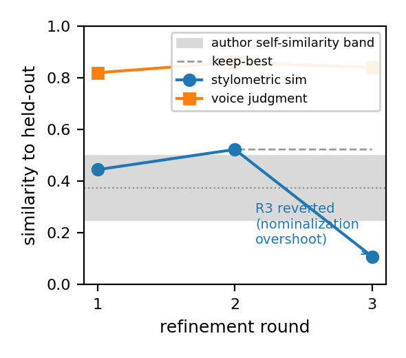

# Calibrating an author's voice

`/sws:calibrate-style` builds a reusable *voice profile* from an author's own papers, so the drafter and reviser write in that author's register rather than a generic one. This page explains how it works, shows a worked example on a real corpus, and tells you what to expect — including the numbers we fitted, so you can build on (or argue with) the method.

> **Privacy.** A voice profile is personal. It is written to `_voice/` inside the author's own paper project and is never pushed to this repo. Everything below is the *method* plus *anonymized aggregate results* from one dogfood run — no source papers are named and no real authored prose is reproduced.

## The idea in one sentence

Hold out one of the author's own recent papers, regenerate one of its sections *in the candidate voice on the paper's real content*, measure how close the regenerated prose is to the real thing, and refine the profile until the regenerated text is **as similar to the held-out paper as the author's own papers are to each other** — that ceiling is the *self-similarity band*.

## Pipeline

1. **Discover** — find the author's papers (e.g. from Zotero), ranked by authorship position (first / last / corresponding weigh most; middle author weighs least).
2. **Flag & split** — the author curates the list; the tool holds out 1–2 recent first-author papers as a hidden test target.
3. **Extract** — read the narrative sections (Introduction, Discussion/Conclusions) where personal voice lives; Methods/Results are convention-bound and excluded.
4. **Diachronic pass** — fingerprint every paper by year to show how the voice drifted over time (a descriptive side-output).
5. **Calibrate loop** — fit the voice metric, then generate → score → diagnose → revise → repeat until the score reaches the self-similarity band (or plateaus).

## How "closest match" is measured

Three pieces combine into **one** fitted similarity, not a hand-tuned blend:

- **Stylometric feature vector** (17 features): sentence-length mean/variance, hedge density, connective density, passive ratio, lexical diversity, first-person-plural rate, and a set of function-word frequencies.
- **A weighted distance** `D = Σ wᵢ·(xᵢ − yᵢ)²  +  w_h·(1 − haiku_sim)`. The stylometric features are differenced; a qualitative voice-similarity score (a Haiku judgment) enters as one more term.
- **Fitted weights from boundary conditions.** The weights `{wᵢ, w_h}` are *learned*, not guessed, by a diagonal Fisher ratio: features that are stable *within* the author but *separate* the author from a **peer baseline** get the most weight. This is the crucial knob — see the worked example.
- **An RBF kernel** wraps the distance into a bounded similarity in (0, 1], `k = exp(−γ·D)`, with γ set from the spread of the author's own papers. The **self-similarity band** (the kernel similarity the author's papers reach against each other) is the convergence target — you cannot imitate an author more closely than the author imitates themselves across papers.

## The refinement loop (how the generator is steered)

Each round: generate the held-out section in the candidate voice (same content, voice is the only free variable) → score against the real held-out text → read the *per-feature contributions* to the distance to see exactly which features diverge → make a **targeted** edit to the profile → regenerate. A **keep-best** rule reverts any round that worsens the score, so the loop is monotone and can't oscillate forever.

## Worked example (real corpus, anonymized)

We dogfooded this on a real ~14-paper corpus from a single author (chemistry / de novo metalloproteins), holding out an unseen recent first-author paper. The baseline ("not-this-author") was **four external groups in the same subfield** — deliberately *not* the author's collaborators or lab.

**Convergence:** the recency-weighted profile reached the self-similarity band on the first pass and the best round landed just above it.

| Round | Stylometric sim | In band? (lo 0.25 / hi 0.50) | Voice judgment | Result |
|---|---|---|---|---|
| 1 | 0.45 | inside, near mean | 0.82 | over-egged: sentences too long, "we" too dense |
| 2 | **0.52** (0.56 on corrected baseline) | at / just above hi | **0.86** | **best — kept** |
| 3 | 0.11 | far below | 0.84 | overshoot → **reverted** |

**The fitted weights (the part worth studying).** Top discriminators in this run:

| feature | weight | reads as |
|---|---|---|
| `fw_that` | 0.16 | subordinate "that"-clause embedding ("we reasoned that…") |
| `fw_for` | 0.10 | purpose-framed "for" ("tailored for", "proficient for") |
| `sentence_len_sd` | 0.10 | mid-variance cadence (not metronomic, not bursty) |
| `fw_of` | 0.07 | "of"-nominalization rate |
| `fw_the` | 0.06 | — |
| `fw_and` | 0.05 | coordination rate |

**Baseline choice changes everything.** Our *first* attempt put an aspirational close co-author in the baseline. That was wrong: the co-author writes a near-twin style, so the metric mistook shared good style for "not the author," and the top discriminators came out as bulk function-word frequencies (`fw_and` ≈ 0.19, `fw_of` ≈ 0.14) — an artifact of mixing review-register prose into the baseline. Swapping to a clean peer baseline of *other* groups moved the signal to **clause architecture** (`fw_that`, `fw_for`) — a far more defensible authorship signal that survives topic and persists even though every peer says "we" just as often. **Lesson: the negative/baseline set defines what "your voice" even means. Use peers whose style genuinely differs; never your collaborators or your own lab.**

**The Haiku term, in this run.** We stood in a deterministic judge for the qualitative score, so `w_h` fitted to ≈ 0 here. In a production run, real Haiku similarity scores on the anchor pairs would give `w_h` real weight — it is the slot designed to capture the higher-order voice traits stylometry misses. Tuning how much to trust it (and how to prompt the judge) is open territory for contributors.

**Steering lesson (the round-3 trap).** Chasing a *single* function-word gap (`fw_of`) by rewriting clauses as "the X of Y" nominalizations overshot hard — that one feature contributed 1.94 of the 2.78 total distance and collapsed similarity from 0.52 to 0.11. Move several features gently; never grind one to target at the expense of register. Keep-best caught it and reverted.

## What to expect

- **The band is the ceiling, and it's an intra-author property** — robust to which baseline you pick (ours barely moved, 0.50 → 0.51, when we swapped baselines). Don't expect similarity ≈ 1.0; expect to *enter the band*.
- **Recency-weighting targets your current voice**, not a career average. The diachronic pass is a separate descriptive artifact.
- **3+ papers** give a meaningful band; 2 papers give a degenerate one.
- **Convergence in 1–3 rounds** is typical when the profile generalizes; more rounds usually means the corpus is heterogeneous (mixed registers, many co-authored middle-author papers).

## For contributors

The weights, the RBF bandwidth heuristic, the self-band definition, and the `w_h` Haiku term are all explicit and tunable in `scripts/sws_stylometry.py`. Promising directions: a real-Haiku `w_h` calibration study; richer features (syntactic n-grams, discourse-marker inventories); a learned (non-diagonal) metric; and per-section weight sets. The held-out + self-band protocol gives you an objective yardstick to test any change against.
